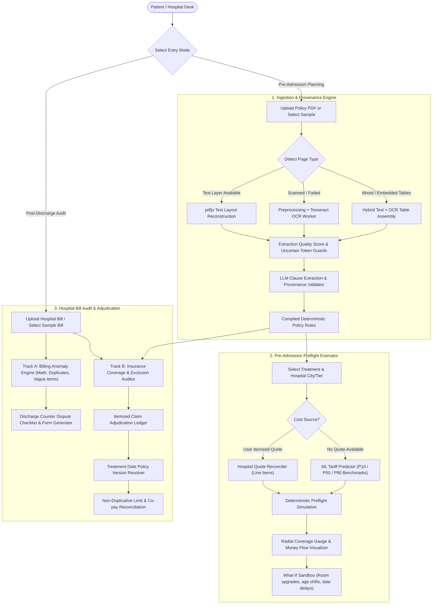

# 🛡️ PolicyLens (ClaimLens) — Prototype Status & Architecture Report

*Comprehensive Architecture, Feature Catalog & kMatrix 5.0 (FIN 01) Final Round Roadmap*  
*Last Updated: October 10, 2026 | Git Commit: `6fa280b` (main)*

---

## 1. 📊 Executive Summary & Health Check

| Metric | Status | Details |
| :--- | :---: | :--- |
| **Next.js Build Status** | 🟢 **PASSING** | Next.js 16.3.3 (Turbopack) compiles cleanly (`npm run build` exits 0) |
| **Acceptance Test Suite** | 🟢 **100% PASS (33/33)** | Core normalizers, waiting periods, room caps, co-pays, ML cost integration, and bill audit in `tests/acceptance_tests.ts` |
| **OCR & Hybrid Ingestion Tests** | 🟢 **100% PASS (48/48)** | Layout analysis, token verification, deskewing, mixed-mode routing, and uncertain token safeguards in `tests/ocr_tests.ts` |
| **Total Automated Assertions** | 🟢 **81 / 81 PASS** | Combined automated test coverage passing with 0 failures |
| **GitHub Synchronization** | 🟢 **100% IN SYNC** | `main` branch synchronized with `origin/main` at commit `6fa280b` |
| **AI Inference Provider** | 🟢 **Active** | Primary: Google Gemini 2.5 Flash; Automatic fallback: OpenAI GPT-4o-mini |
| **Local OCR Worker** | 🟢 **Active** | Pure Node.js / Canvas / Tesseract.js worker with offline bilingual/English dictionary |
| **Calculation Engine** | 🟢 **Deterministic** | 100% pure TypeScript financial arithmetic — **Zero LLM Math** |
| **Design System** | 🟢 **Active** | PolicyLens "Forest Floor" & Lamp Amber token design system (`theme.css`, `ledger.css`) |

---

## 2. 🎯 Problem Statement (FIN 01: Insurance Coverage & Treatment Cost Intelligence)

Over **70% of health insurance policyholders in India** experience unexpected out-of-pocket expenses when settling bills at hospital discharge desks. Despite paying regular premiums for policies with ₹5,00,000 to ₹10,00,000 Sum Insured, patients routinely face unexpected out-of-pocket bills of ₹50,000 to ₹1,50,000+.

### Core Drivers of Unexpected Claim Shortfalls:
1. **Dense Policy Jargon & Hidden Endorsements**: Policy wording documents span 30 to 60 pages of convoluted legal clauses, ambiguous definitions, exclusion annexures, and policy endorsement amendments that alter terms over time.
2. **The Proportionate Deduction Trap**: Selecting a room tier (e.g. Deluxe Suite or Single Private) above the policy's sanctioned limit (e.g. Twin Sharing or 1% of Sum Insured) triggers proportionate penalties across *all* associated hospital fees—including surgeon charges, OT fees, and nursing care.
3. **Calendar Waiting Period Pitfalls**: Elective and specific illnesses (such as cataract, hernia, joint replacement, hysterectomy) carry mandatory 24-month or 48-month waiting periods. Being admitted even **one day before** milestone completion results in a 100% claim denial.
4. **Hidden Co-payments & Sub-limits**: Senior citizen clauses (10–20% co-pay) and procedure-specific caps (e.g., ₹25,000 for cataract or ₹50,000 for robotic surgery) are buried in obscure sub-clauses.
5. **Hospital Billing Anomalies**: Discrepancies between unit rates and billed sums ($Qty \times Rate \neq Total$), duplicate unbundled line items, and non-specific descriptions (*"Sundry Charges"*, *"Miscellaneous"*) lead to outright insurer disallowance.
6. **No Pre-Admission Transparency**: Prior to PolicyLens, patients had no mechanism to simulate hospital estimates against their policy before admission, nor verify final discharge bills against policy clauses after treatment.

---

## 3. 💡 Architectural Foundation & Principles

PolicyLens bridges the gap between insurer contracts and real-world hospital billing. It ingests complex health insurance policy PDFs and hospital estimates/bills, extracts coverage clauses with exact page-level citations, compiles them into strongly-typed executable rules, and performs **preflight simulations** and **itemized claim adjudications** with complete **Clause-to-Rupee traceability**.

```
┌─────────────────────────────────────────────────────────────────────────────────┐
│                           AI & OCR EXTRACTION LAYER                             │
│   • Multi-Modal Hybrid PDF (Text-layer + Tesseract OCR with Deskewing)          │
│   • Verbatim Clause Extraction (Gemini 2.5 Flash / GPT-4o-mini)                 │
│   • Character Span & Page Offset Provenance Verification                        │
└────────────────────────────────────────┬────────────────────────────────────────┘
                                         │ Structured JSON Rules
                                         ▼
┌─────────────────────────────────────────────────────────────────────────────────┐
│                        DETERMINISTIC COMPILER & MATCHER                         │
│   • Rule Compiler (Categorization, rupee parsing, percentage extraction)        │
│   • Treatment Date Version Resolver (Base Policy vs Amendment Rider)            │
│   • Semantic Bill-to-Clause Retrieval & Evidence Ambiguity Classifier           │
└────────────────────────────────────────┬────────────────────────────────────────┘
                                         │ Strongly-typed Rules & Verifiable Matches
                                         ▼
┌─────────────────────────────────────────────────────────────────────────────────┐
│                    PURE DETERMINISTIC FINANCIAL ENGINE                          │
│   • Zero LLM Math: 100% Pure TypeScript Arithmetic                              │
│   • 5-Column Line-Level Adjudication: Claimed | Payable | Deductions | Clause   │
│   • Non-Duplicative Cascade: Exclusions → Sub-limits → Deductible → Co-pay      │
│   • What-If Live Simulation & Out-of-Pocket Minimizer                           │
└─────────────────────────────────────────────────────────────────────────────────┘
```

### ⚡ The Core Philosophy: Zero LLM Math
> **"Language models are exceptional at reading comprehension and textual extraction, but catastrophic at financial arithmetic, non-duplicative cascade deductions, and calendar boundary calculations."**

PolicyLens strictly enforces an architectural boundary:
1. **AI Extraction Layer**: Large Language Models extract clauses, verbatim policy excerpts, and numeric caps.
2. **Provenance Verification**: Verbatim citations are cross-checked against exact character spans in the source PDF (`lib/pdf/validation.ts`).
3. **Deterministic Compiler**: Extracts are compiled into typed executable rule sets with conditions, room categories, percentages, and rupee thresholds (`lib/policy/compiler.ts`).
4. **Pure Deterministic Math**: All room rent penalties, co-pays, sub-limits, remaining sum insured deductions, and waiting-period calendar math are computed in pure TypeScript (`lib/estimate/cost.ts`, `lib/bill/auditor.ts`). **An LLM never calculates a rupee value.**

---

## 4. 🗺️ Complete End-to-End System & User Flow



### Route & Component Navigation Breakdown:
1. **`/` (Public Landing Page)**:
   - Located at `app/page.tsx` rendering `components/landing-page.tsx`.
   - Dimmed hospital corridor background, live Indian claims stats ticker, 4-step workflow overview, and 1-click CTA.
2. **`/app` (Interactive Intelligence Workspace)**:
   - Located at `app/app/page.tsx` rendering `components/policy-lens.tsx`.
   - State machine: `upload` $\rightarrow$ `processing` $\rightarrow$ `results` (with multi-tab GooeyNav).
3. **Workspace Tabs**:
   - **Tab 1: Preflight Estimator (`CostLedger.tsx`, `CoverageGauge.tsx`)**: Pre-admission simulation, room caps, waiting period boundaries, and What-If sandbox.
   - **Tab 2: Hospital Bill Audit (`BillAudit.tsx`)**: Dual-track hospital billing error detector, suspicious charge locator, and discharge dispute checklist.
   - **Tab 3: Conversational Policy Assistant (`PolicyQA.tsx`)**: Multi-turn grounded Q&A with verbatim PDF page citations.
   - **Tab 4: Policy Clauses & Provenance (`CoverageRiskAnalyzer.tsx`, `ExtractionQuality.tsx`)**: Verbatim extracted rules, OCR confidence inspector, and risk categorization.
   - **Tab 5: Quote Reconciler (`QuoteReview.tsx`)**: Line-item breakdown of hospital estimates.
4. **Backend API Endpoints**:
   - `POST /api/policy/analyze`: Multi-modal hybrid text/OCR extraction, LLM rule synthesis, and provenance verification.
   - `POST /api/bill/analyze`: Hospital discharge bill ingestion and structured item extraction.
   - `POST /api/policy/ask`: Grounded policy assistant with character span citations.
   - `POST /api/quote/analyze`: Hospital estimate item parser and category classifier.
   - `POST /api/claim-dispute`: Formal dispute letter and counter checklist generation.

---

## 5. 🚀 Comprehensive Feature Catalog (Currently Built)

### A. Hybrid Document Ingestion & OCR Engine (`lib/ocr/`, `lib/pdf/`)
- **Per-Page Routing**: Dynamically classifies every PDF page as `text_layer`, `ocr`, or `hybrid` based on font encoding health, vector density, and embedded images.
- **Image Preprocessing & Deskewing (`lib/ocr/preprocess.ts`)**: Automatic orientation correction, grayscale thresholding, and contrast sharpening before OCR.
- **Tesseract Worker (`lib/ocr/tesseract.ts`)**: Offline OCR worker parsing scanned policy endorsements, hospital seals, and degraded printouts.
- **Ambiguous Token Flagging (`lib/ocr/layout.ts`)**: Flags character confusion (e.g., `Rs 5,0O,000` with letter `O`, or `2O%` co-pay) and marks them as uncertain.
- **OCR Safety Safeguards**: Ensures uncertain OCR amounts are **never** fed into financial calculations; automatically flags rules for human confirmation (`ExtractionQuality.tsx`).

### B. Core Financial Intelligence & Preflight Engine (`lib/estimate/`, `lib/policy/`)
- **Deterministic Rule Compiler (`lib/policy/compiler.ts`)**: Compiles raw extracted text into typed rules (`coverage`, `exclusion`, `waiting_period`, `room_rent`, `co_payment`, `sub_limit`, `deductible`).
- **Quote-First Cost Engine (`lib/estimate/cost.ts`)**: Calculates proportionate room penalties, non-payable consumables, and base charge reductions.
- **Policy Preflight Engine (`lib/estimate/policy.ts`)**: Evaluates eligibility, waiting periods, deductibles, co-pays, and sub-limits against patient scenarios.
- **Indian Cost Benchmark Matrix (`lib/estimate/dataset.ts`)**: 16 major surgical procedures localized across Tier 1, 2, and 3 Indian cities with Public/Private/Corporate hospital multipliers.
- **Procedure Fuzzy Matcher (`lib/estimate/matching.ts`)**: Maps messy colloquial terms (*"knee op"*, *"angio"*, *"gall bladder removal"*) to canonical clinical keys.
- **Indian Financial Normalizers (`lib/policy/normalizers.ts`)**: Handles Indian numbering formats (`₹5,00,000`, `2.5 Lakhs`, `Rs 15000`), durations (`24 months`, `30 days`), and dates.

### C. Hospital Bill Verification & Suspicious Charge Detection (`lib/bill/`, `components/policy/BillAudit.tsx`)
- **Track A — Hospital Billing Verification (Internal Anomalies)**:
  - **Arithmetic Discrepancy Engine**: Verifies $Quantity \times Unit\ Price \equiv Amount$ with ₹2 rounding tolerance and explicit mathematical formulas.
  - **Duplicate Charge Detection**: Levenshtein distance and token-overlap matcher flagging double-billed equipment and unbundled services.
  - **Vague Charge Detection**: Flags ambiguous line items (*"Miscellaneous"*, *"Sundry Services"*, *"Admin Fees"*) that insurers reject.
  - **Bill-Total Reconciliation**: Checks line-item totals against stated gross billed amounts.
  - **Excessive Miscellaneous Alert**: Warns when unclassified charges exceed 15% of the total bill.
- **Track B — Insurance Policy Coverage Verification**:
  - **Consumable Exclusion Matcher**: Flags non-payable surgical disposables (PPE, gloves, syringes, drapes) with verbatim policy citations.
  - **Sub-Limit Monitor**: Compares high-cost items (stents, implants, cataract lenses) against policy caps.
  - **Room-Rent Proportionate Exposure**: Alerts when room charges exceed policy eligibility, warning of surgeon fee proration.
  - **Waiting Period Clinical Cross-Check**: Matches bill diagnosis against 24-month or 48-month specific illness schedules.
- **Discharge Counter Dispute Desk**: Interactive checklist with 1-click clipboard copying and printable dispute letters for billing clerks.

### D. Machine Learning Tariff Predictor (`ml_service/`)
- **Supervised Regression Model**: Trained on thousands of Indian clinical cases across procedures, hospital types, and city tiers.
- **Distribution Estimates**: Outputs $P_{10}$ (min), $P_{50}$ (typical), and $P_{90}$ (max) cost ranges with cost driver breakdowns.
- **Documented Evaluation**: Detailed performance benchmarks, RMSE/MAE metrics, and baseline comparisons in `ml_service/ML_MODEL_EVALUATION.md`.

---

## 6. 🏆 kMatrix 5.0 Final Round (FIN 01) Evaluation & Gap Analysis

The Final Round prompt specifies two mandatory additions and rigorous submission criteria. Below is the precise audit of current prototype readiness against these requirements.

```
┌────────────────────────────────────────────────────────────────────────────────────────┐
│                        kMatrix 5.0 FIN 01 READINESS OVERVIEW                           │
├───────────────────────────────────┬──────────────┬─────────────────────────────────────┤
│ Component                         │ Status       │ Gap to Bridge                       │
├───────────────────────────────────┼──────────────┼─────────────────────────────────────┤
│ Addition 1: Claim Adjudication    │ 🟡 Partial   │ Policy Amendment/Version Resolver & │
│                                   │ (65%)        │ 5-Column Adjudication Ledger        │
├───────────────────────────────────┼──────────────┼─────────────────────────────────────┤
│ Addition 2: Semantic Verification │ 🔴 Missing   │ Semantic Vector Matcher vs Keyword  │
│                                   │ (25%)        │ Baseline & Benchmark Labeled Eval   │
├───────────────────────────────────┼──────────────┼─────────────────────────────────────┤
│ 4 Mandatory Demo Scenarios        │ 🟡 Partial   │ Explicit named scenario presets     │
│                                   │ (50%)        │ with before/after ledger comparison │
├───────────────────────────────────┼──────────────┼─────────────────────────────────────┤
│ Reproducible Evidence Package     │ 🟡 Partial   │ Formal EVIDENCE_PACKAGE.md with     │
│                                   │ (35%)        │ baseline tables & replay logs       │
└───────────────────────────────────┴──────────────┴─────────────────────────────────────┘
```

---

### A. Addition 1: Itemized Claim Adjudication

| Specification Requirement | Current State in Prototype | Gaps to Implement |
| :--- | :--- | :--- |
| **1. Ingest itemized bill + policy with applicable amendment** | Single policies (`samplePolicies.ts`) and bills (`sampleBills.ts`) exist independently. | Implement `PolicyVersion` and `PolicyAmendment` schemas (e.g., *2023 Base Policy* vs *2024 Endorsement Rider* adding robotic surgery caps). |
| **2. Identify document version & effective date by treatment date** | Static policy loaded with no date precedence logic. | Build `resolvePolicyVersion(policy, treatmentDate)` to dynamically select base vs amendment rules based on admission date. |
| **3. Per-item 5-element adjudication** | Categorical badges (`likely_covered`, `likely_excluded`) and text findings in `BillAudit.tsx`. | Formal 5-column **Itemized Claim Adjudication Ledger**:<br>1. Claimed Amount (₹)<br>2. Potentially Payable / Admissible Amount (₹)<br>3. Deduction / Disallowance (₹)<br>4. Applicable Policy Clause Citation<br>5. Information Requiring Review / Ambiguity Flag |
| **4. Non-duplicative global reconciliation** | Preflight engine applies global deductibles, but bill auditor does not reconcile line-level items with policy caps. | Implement deterministic non-duplicative cascade:<br>$\text{Admissible} = \text{Claimed} - \text{Item Deductions}$<br>$\text{Net Payable} = \max(0, \text{Admissible} - \text{Policy Deductible}) \times (1 - \text{Co-pay})$.<br>Ensures deductible is never double-applied to excluded items. |
| **5. Dynamic recomputation** | Bill items can be edited in UI. | Automatically recompute entire ledger when bill line item or governing policy amendment is toggled. |

---

### B. Addition 2: Semantic Matching & Verification of Policy Evidence

| Specification Requirement | Current State in Prototype | Gaps to Implement |
| :--- | :--- | :--- |
| **1. Semantic retrieval / reranking model linking varied descriptions** | Hardcoded substring matching (`CONSUMABLES_EXCLUDED_KEYWORDS`). Easily fails on medical synonyms (e.g. *"Arthroplasty kit"*, *"Trocar cannula"*). | Build `lib/bill/semanticMatcher.ts` featuring a dual architecture:<br>• **Baseline**: Normalized token Jaccard / BM25 matcher.<br>• **Semantic Model**: Embedding similarity / LLM reranker linking varied bill descriptions to policy clauses. |
| **2. Verify evidence support vs ambiguity with excerpts & confidence** | Static text confidence (`high` / `medium`). | Implement formal ambiguity classifier returning: `verdict: 'supported' \| 'excluded' \| 'ambiguous' \| 'conflicting'`, confidence score ($0.0 - 1.0$), and supporting policy excerpt. |
| **3. Preserve exact policy arithmetic outside learned model** | Fully adhered to (Zero LLM Math). | Formally integrate semantic clause links as inputs to the deterministic financial adjudicator. |
| **4. Evaluate against keyword matching using separately labeled examples** | Cost model evaluation exists, but zero evaluation for bill-to-clause retrieval. | 1. Create `data/bill_clause_benchmark.json` (40+ labeled pairs covering exact matches, synonyms, unbundled items, exclusions, and conflicting terms).<br>2. Create `scripts/evaluate_retrieval.ts` measuring **Precision@1, Recall, MRR, Ambiguity F1**, and latency against the keyword baseline. |

---

### C. The 4 Mandatory End-to-End Demonstration Scenarios

The competition guidelines require **at least four distinct end-to-end scenarios** demonstrating the two additions together:

```mermaid
graph TD
    subgraph S1["Scenario 1: Clean Supported Claim"]
        direction TB
        S1_Desc["Standard Inpatient Admission (Appendectomy)<br>All charges standard, valid diagnosis, eligible room"]
        S1_Out["✅ Outcome: Admissible ledger matches claimed sum minus standard policy co-pay"]
    end

    subgraph S2["Scenario 2: Excluded Item"]
        direction TB
        S2_Desc["Unbundled Bill with Non-Medical Consumables<br>Surgical kit, PPE, documentation fees, toiletries"]
        S2_Out["❌ Outcome: Itemized 100% deduction with verbatim Clause 4.2 citations"]
    end

    subgraph S3["Scenario 3: Missing / Conflicting Evidence"]
        direction TB
        S3_Desc["Vague Line Item: 'OT Sundry Charges ₹18,500'<br>Conflicting clauses regarding day care vs inpatient OT"]
        S3_Out["⚠️ Outcome: Flagged for review; ambiguity badge; excluded from immediate auto-pay"]
    end

    subgraph S4["Scenario 4: Policy Amendment / Version Shift"]
        direction TB
        S4_Desc["Robotic Joint Replacement with Treatment Date Shift<br>Pre-amendment: 100% covered | Post-amendment: ₹50,000 sub-limit cap"]
        S4_Out["🔄 Outcome: Side-by-side Before & After Ledger diff with version selection trace"]
    end
```



1. **Scenario 1 (Clean Supported Claim — Normal Operation)**:
   - Inpatient admission where charges conform to sanctioned room categories, diagnosis clears waiting periods, and line items are payable.
   - Visible outcome: Complete financial breakdown, positive payout, zero arbitrary disallowances.
2. **Scenario 2 (Excluded Item — Clear Clause Denial)**:
   - Bill containing unbundled non-medical disposables, admin charges, and surgical consumables.
   - Visible outcome: Exact clause citations, ₹0 payable for excluded rows, transparent out-of-pocket ledger.
3. **Scenario 3 (Missing or Conflicting Evidence — Uncertainty & Review)**:
   - Bill containing vague charges (*"OT Sundry Materials ₹18,500"*) or conflicting policy rider terms.
   - Visible outcome: Semantic matcher flags ambiguity, assigns review flag, holds item from automated approval.
4. **Scenario 4 (Policy Amendment Version Change — Changing Information)**:
   - Treatment date in 2023 (under Base Policy: robotic surgery fully covered) vs 2024 (under Amendment Rider: ₹50,000 robotic surgery cap).
   - Visible outcome: Dynamic version badge resolution and **Before vs After Adjudication Ledger comparison**.

---

### D. Evidence Package Submission Requirements

To comply with the final round submission rubric, the evidence package must provide:
1. **Repository Commit Tracking**: Start commit hash, final commit hash, and concise change summary.
2. **Evaluator Execution Command**: `npm run test` and `npx tsx scripts/evaluate_retrieval.ts` reproducing all benchmark tables.
3. **Data Schema & Benchmark Declarations**:
   - Declared labels, sample counts, class balance, units, and thresholds.
   - Reference labels verified independently (model does not certify its own answers).
4. **Baseline Comparison Report**: Detailed comparison table showing Semantic Matcher vs Keyword Baseline across Precision@1, Recall, and Ambiguity F1.
5. **Documented Limitations & Edge Cases**: Explicit failure case analysis (e.g. multi-procedure bundled surgeries where item unbundling cannot be determined).

---

## 7. 📅 Implementation Roadmap for Final Sprint

```
Sprint Timeline:
┌─────────────────────────┬─────────────────────────┬─────────────────────────┐
│ Phase 1 & 2             │ Phase 3 & 4             │ Phase 5                 │
│ • Versioning Models     │ • Adjudication Engine   │ • UI Adjudication View  │
│ • Semantic Matcher      │ • Benchmark Dataset     │ • 4 Demo Presets        │
│ • Keyword Baseline      │ • Eval Runner Script    │ • EVIDENCE_PACKAGE.md   │
└─────────────────────────┴─────────────────────────┴─────────────────────────┘
```

### Phase 1: Policy Versioning & Amendment Architecture
- [ ] Create `lib/types/adjudication.ts` defining `PolicyVersion`, `PolicyAmendment`, and `ItemAdjudicationLine`.
- [ ] Update `samplePolicies.ts` with *HDFC Optima Secure 2023 Base Policy* and *2024 Amendment Rider* (introducing robotic surgery cap and altering ICU limits).
- [ ] Implement `resolvePolicyVersion(policy, treatmentDate)` to determine governing contract version.

### Phase 2: Semantic Retrieval & Evidence Verification Engine
- [ ] Build `lib/bill/semanticMatcher.ts`:
  - Keyword baseline (token Jaccard / normalized n-grams).
  - Semantic matcher (embedding cosine similarity / LLM reranker).
  - Ambiguity and conflict classifier returning evidence excerpts and confidence scores.

### Phase 3: Itemized Claim Adjudication Engine
- [ ] Build `lib/bill/adjudicator.ts`:
  - Computes claimed, payable, and deduction for every line item.
  - Implements non-duplicative global reconciliation (deductibles, co-pays, room proration).
  - Recomputes in real-time upon bill edits or amendment toggling.

### Phase 4: Labeled Benchmark Dataset & Evaluation Script
- [ ] Create `data/bill_clause_benchmark.json` (40+ curated labeled pairs across medical synonyms, unbundled consumables, exclusions, and conflicting clauses).
- [ ] Build `scripts/evaluate_retrieval.ts` executing reproducible evaluations comparing Semantic Retrieval vs Keyword Baseline.

### Phase 5: UI Integration & Evidence Package
- [ ] Add **Adjudication Ledger View** in `components/policy/BillAudit.tsx`:
  - 5-column itemized financial ledger.
  - **Before vs After Amendment Comparison Toggle**.
  - **4 1-Click Demonstration Preset Buttons**.
- [ ] Generate comprehensive `EVIDENCE_PACKAGE.md` with commit hashes, evaluation tables, scenario replay logs, and documented edge cases.
