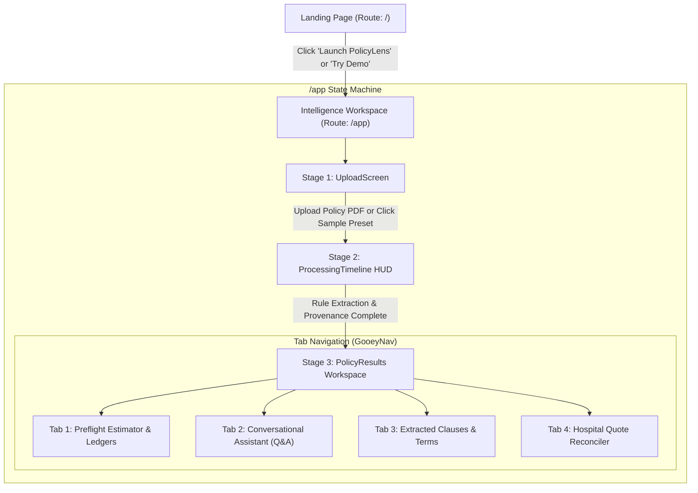

# 🛡️ PolicyLens (PolicyLens) — Prototype Status & Architecture Report

*Generated on October 8, 2026*

---

## 1. 📊 Executive Summary & Health Check

| Metric | Status | Details |
| :--- | :--- | :--- |
| **Build Status** | 🟢 **PASSING** | Next.js 16.3.3 (Turbopack) compiles with zero errors (`npm run build` exits 0) |
| **Acceptance Tests** | 🟢 **100% PASS (7/7)** | 21/21 assertions passing via `tests/acceptance_tests.ts` |
| **GitHub Synchronization** | 🟢 **100% IN SYNC** | `main` and `digi` branches on GitHub match local repository byte-for-byte |
| **Primary AI Provider** | 🟢 **Active** | Google Gemini 2.5 Flash with OpenAI GPT-4o-mini automatic fallback |
| **Calculation Engine** | 🟢 **Deterministic** | 100% pure TypeScript financial arithmetic — **Zero LLM Math** |
| **Supported Workflows** | 🟢 **End-to-End** | Upload → Extract → Compile Rules → Preflight Calculation → What-If Sandbox → Q&A |

---

## 2. 🎯 Problem Statement

Over **70% of health insurance policyholders in India** face surprise out-of-pocket expenses when settling bills at hospital discharge desks. Despite paying regular premiums for policies with ₹5,00,000 to ₹10,00,000 Sum Insured, patients routinely face unexpected out-of-pocket bills of ₹50,000 to ₹1,50,000+.

### Core Drivers of the Problem:
1. **Dense Policy Jargon**: Policy wording documents span 30 to 60 pages of convoluted legal clauses, ambiguous definitions, and dense schedule tables.
2. **The Proportionate Deduction Trap**: Selecting a room tier (e.g. Deluxe Suite or Single Private) above the policy's sanctioned limit (e.g. Twin Sharing or 1% of Sum Insured) triggers proportionate penalties across *all* associated hospital fees—including surgeon charges, OT fees, and nursing care.
3. **Calendar Waiting Period Pitfalls**: Elective and specific illnesses (such as cataract, hernia, joint replacement, hysterectomy) carry mandatory 24-month or 48-month waiting periods. Being admitted even **one day before** milestone completion results in a 100% claim denial.
4. **Hidden Co-payments & Sub-limits**: Senior citizen clauses (10–20% co-pay) and procedure-specific caps (e.g., ₹25,000 for cataract or ₹50,000 for robotic surgery) are buried in obscure sub-clauses.
5. **No Pre-Admission Transparency**: Prior to PolicyLens, patients had no mechanism to simulate hospital estimates against their policy before admission.

---

## 3. 💡 Our Solution & Architectural Foundation

**PolicyLens** bridges the gap between insurer contracts and real-world hospital billing. It ingests complex health insurance policy PDFs and hospital estimates, extracts coverage clauses with exact page-level citations, compiles them into strongly-typed executable rules, and performs **pre-admission preflight simulations** with complete **Clause-to-Rupee traceability**.

### ⚡ The Core Philosophy: Zero LLM Math
> **"Language models are exceptional at reading comprehension and textual extraction, but catastrophic at financial arithmetic and calendar boundary calculations."**

PolicyLens strictly enforces an architectural boundary:
1. **AI Extraction Layer**: Large Language Models (Google Gemini 2.5 Flash with OpenAI GPT-4o-mini fallback) extract clauses, verbatim policy excerpts, and numeric caps.
2. **Provenance Verification**: Verbatim citations are cross-checked against exact character spans in the source PDF (`lib/pdf/validation.ts`).
3. **Deterministic Compiler**: Extracts are compiled into typed executable rule sets with conditions, room categories, percentages, and rupee thresholds (`lib/policy/compiler.ts`).
4. **Pure Deterministic Math**: All room rent penalties, co-pays, sub-limits, remaining sum insured deductions, and waiting-period calendar math are computed in pure TypeScript (`lib/estimate/cost.ts`, `lib/estimate/policy.ts`). **An LLM never calculates a rupee value.**

---

## 4. 🚀 Features Built So Far

### A. Core Engine & Financial Intelligence

| Component | Path | Description |
| :--- | :--- | :--- |
| **Deterministic Rule Compiler** | `lib/policy/compiler.ts` | Transforms raw extracted clause data into strongly-typed, executable policy rules. |
| **Quote-First Cost Engine** | `lib/estimate/cost.ts` | Calculates proportionate room penalties, consumable deductions,and net base charges. |
| **Policy Preflight Engine** | `lib/estimate/policy.ts` | Evaluates eligibility, waiting periods, deductibles, co-pays, and sub-limits against patient scenarios. |
| **Indian Cost Benchmark Matrix** | `lib/estimate/dataset.ts` | Localized benchmarks across Tier 1, 2, and 3 Indian cities with Public/Private/Corporate multipliers for 16 procedures. |
| **Procedure Fuzzy Matcher** | `lib/estimate/matching.ts` | Maps natural language inputs (e.g. *"knee surgery"*, *"angio"*) to standardized clinical keys. |
| **Normalizers & Parsers** | `lib/policy/normalizers.ts` | Robust parsing of Indian currency strings (`₹5,00,000`, `2.5 Lakhs`, `Rs 15000`), durations, and room categories. |
| **PDF Extraction & Provenance** | `lib/pdf/extractor.ts` & `validation.ts` | Server-side text extraction with page-level offset mapping and quote verification. |

### B. Interactive User Interface Components

| Feature | Component | Visual / Interactive Functionality |
| :--- | :--- | :--- |
| **Landing Page** | `components/landing-page.tsx` | Modern hero section with dimmed hospital corridor background, live stats ticker (₹4.2 Cr claims, 98.4% accuracy), 4-step process breakdown, and 1-click launch CTA. |
| **Redesigned Upload Screen** | `components/policy/UploadScreen.tsx` | Split-layout upload experience with subtle dot-grid backdrop, drag-and-drop PDF dropzone, and 1-click sample policy presets (*HDFC ERGO Optima Secure ₹10L*, *Star Health Comprehensive ₹5L*). |
| **Processing HUD** | `components/policy/ProcessingTimeline.tsx` | Cybernetic scanning interface featuring animated laser sweeps and multi-stage status indicators. |
| **Radial Coverage Gauge** | `components/policy/CoverageGauge.tsx` | Biometric SVG radial meter showing instant percentage of bill covered with safety tier badges (🟢 Insurer Heavy, 🟡 Shared Risk, 🔴 High Out-of-Pocket) and tri-color distribution bar. |
| **Interactive Money-Flow Pipeline** | `components/policy/ClauseFlowVisualizer.tsx` | Animated step-by-step pipeline ($\text{Gross} \rightarrow \text{Room Cap} \rightarrow \text{Sub-limits} \rightarrow \text{Deductible} \rightarrow \text{Co-pay} \rightarrow \text{Final}$) with click-to-audit slide-out drawers. |
| **Clause-to-Rupee Ledger** | `components/policy/CostLedger.tsx` | Itemized auditable breakdown where every rupee deducted is tied to policy clause, verbatim quote, page citation, and mathematical formula. |
| **What-If Scenario Simulator** | `components/policy/WhatIfPanel.tsx` | Live interactive sandboxing for room upgrades/downgrades, senior citizen age shifts (age 60+ co-pay), and admission date delays to calculate instant savings deltas. |
| **Missing Information Engine** | `components/policy/MissingInfoPanel.tsx` | Identifies missing parameters (e.g. policy inception date or declared PEDs) and renders inline interactive controls to resolve ambiguity. |
| **Milestone Timeline** | `components/policy/PolicyTimeline.tsx` | Calendar-exact track visualizing 30-day initial lockout, 24-month specific ailments, and 36/48-month PED milestones relative to admission date. |
| **Hospital Quote Reconciler** | `components/policy/QuoteReview.tsx` | Line-item editor breaking hospital quotes into Room, Nursing, Surgeon/OT, Implants, and Consumables charges. |
| **Conversational Assistant** | `components/policy/PolicyQA.tsx` | Multi-turn AI assistant with document memory, verbatim page citations, and speech-ready interface. |
| **Readiness & Export** | `components/policy/ClaimReadiness.tsx` & `ExportSummary.tsx` | Pre-authorization checklist and printable / JSON summary reports. |

---

## 5. 🗺️ Navigation & User Flow Architecture

### Route Breakdown:
1. **`/` (Landing Page)**:
   - Located at `app/page.tsx` rendering `components/landing-page.tsx`.
   - Optimized public entry point with no AI slop, subtle background parallax, and instant navigation to `/app`.
2. **`/app` (Interactive Intelligence Platform)**:
   - Located at `app/app/page.tsx` rendering `components/policy-lens.tsx`.
   - Powered by WebGL fluid simulation canvas (`components/ui/LiquidEther.tsx`).
   - Manages state transitions seamlessly across Upload $\rightarrow$ Scanning $\rightarrow$ Multi-Tab Analysis.
3. **Backend API Endpoints**:
   - `POST /api/policy/analyze`: Ingests PDF, performs text extraction, calls LLM for clause extractions, and compiles deterministic rules.
   - `POST /api/policy/ask`: Multi-turn conversational endpoint with page citation verification.
   - `POST /api/quote/analyze`: Ingests and categorizes hospital estimate line items.

---

## 6. 🏥 Indian Surgical Cost Benchmark Matrix

When a user does not have an itemized hospital quote, PolicyLens provides pre-calibrated baseline costs across Indian city tiers:

| Procedure | Canonical Key | Tier 1 Typical | Tier 2 Typical | Tier 3 Typical | Typical Stay |
| :--- | :--- | :--- | :--- | :--- | :--- |
| **Total Knee Replacement** | `knee_replacement` | ₹2,80,000 | ₹2,20,000 | ₹1,70,000 | 4 days |
| **Cataract Surgery (Phaco)** | `cataract` | ₹45,000 | ₹35,000 | ₹26,000 | 1 day (Daycare) |
| **Coronary Artery Bypass (CABG)** | `cabg` | ₹3,80,000 | ₹2,90,000 | ₹2,20,000 | 7 days |
| **Laparoscopic Appendectomy** | `appendectomy` | ₹95,000 | ₹75,000 | ₹55,000 | 2 days |
| **Coronary Angioplasty (PTCA)** | `angioplasty` | ₹2,20,000 | ₹1,75,000 | ₹1,35,000 | 2 days |
| **Laparoscopic Cholecystectomy** | `cholecystectomy` | ₹1,10,000 | ₹85,000 | ₹65,000 | 2 days |
| **Total Hip Replacement** | `hip_replacement` | ₹3,10,000 | ₹2,40,000 | ₹1,85,000 | 5 days |
| **Hernia Repair (Inguinal/Umbilical)** | `hernia_repair` | ₹85,000 | ₹65,000 | ₹50,000 | 2 days |
| **Hysterectomy (Abdominal/Laparoscopic)** | `hysterectomy` | ₹1,30,000 | ₹1,00,000 | ₹75,000 | 3 days |
| **Kidney Stone Removal (PCNL/URSL)** | `kidney_stone` | ₹90,000 | ₹70,000 | ₹52,000 | 2 days |
| **Tonsillectomy** | `tonsillectomy` | ₹55,000 | ₹42,000 | ₹32,000 | 1 day |
| **Normal Vaginal Delivery** | `maternity_normal` | ₹65,000 | ₹48,000 | ₹35,000 | 2 days |
| **Caesarean Section (C-Section)** | `maternity_csection` | ₹1,15,000 | ₹85,000 | ₹62,000 | 4 days |
| **Tympanoplasty** | `tympanoplasty` | ₹70,000 | ₹55,000 | ₹40,000 | 1 day |
| **Septoplasty** | `septoplasty` | ₹60,000 | ₹48,000 | ₹36,000 | 1 day |
| **Spine Lumbar Discectomy** | `discectomy` | ₹2,40,000 | ₹1,85,000 | ₹1,40,000 | 3 days |

---

## 7. 🧪 Automated Acceptance Test Suite (21/21 Passing)

The test suite in `tests/acceptance_tests.ts` executes automatically via `npx tsx tests/acceptance_tests.ts`:

1. **Normalizers & Currency Parsing**:
   - `₹5,00,000` $\rightarrow$ `500000`
   - `2.5 Lakhs` $\rightarrow$ `250000`
   - `Rs 15000` $\rightarrow$ `15000`
   - Duration parsing (`24 months`, `30 days`)
2. **Procedure Fuzzy Matching**:
   - `"knee surgery"` $\rightarrow$ `knee_replacement` candidate mapping
3. **Missing Information Engine**:
   - Returns `cannot_determine` status when policy start date is missing
   - Renders interactive prompts requesting `policyStartDate`
4. **Waiting Period Calendar Math**:
   - Admission **1 day before** 24-month wait $\rightarrow$ `waitingPeriodMet = false` (`not_eligible`, itemized deduction)
   - Admission **1 day after** 24-month wait $\rightarrow$ `waitingPeriodMet = true` (positive covered payout)
5. **Age-Conditioned Co-pays**:
   - Age 55 exempt from senior citizen co-pay
   - Age 65 strictly activates 20% senior co-pay with higher patient share
6. **Room Category Proration**:
   - Selecting Deluxe Suite when policy permits Single Private triggers proportionate deduction penalty
7. **Clause-to-Rupee Traceability**:
   - Verifies that deduction amounts, calculation traces, and evidence references exist for all ledger lines

---

## 8. 🧾 Hospital Bill Verification & Suspicious Charge Detection (Phase 1 & Phase 2 Built)

### A. Architecture Overview
ClaimLens features a dedicated **Hospital Bill Audit** module (`Bill Audit` tab) operating on a strict dual-track separation:

1. **Track A — Hospital Billing Verification (Anomalies & Suspicious Charges)**:
   - Evaluates the bill internally with zero reliance on insurance rules.
   - **Arithmetic Discrepancy Engine**: Checks every line item ($Quantity \times Unit\ Rate \equiv Line\ Total$) with tolerance threshold and explicit mathematical discrepancy formulas.
   - **Duplicate Charge Detection**: Uses string normalization and Levenshtein distance matching across identical categories to catch double-billed services and equipment.
   - **Vague / Unitemized Charge Detection**: Flags generic labels (*"Miscellaneous Charges"*, *"Other Charges"*, *"General Administration"*) that insurers reject.
   - **Bill-Total Reconciliation**: Identifies mismatches between stated gross totals and the sum of itemized rows.
   - **Excessive Miscellaneous Ratio**: Alerts when unclassified charges exceed 15% of the total bill.

2. **Track B — Insurance Policy Coverage Verification**:
   - Cross-checks bill items against the active policy rules compiled in ClaimLens.
   - **Exclusion Matching**: Detects non-payable items (surgical consumables, PPE kits, disposables, toiletries, documentation fees) and attaches the verbatim policy clause and page number.
   - **Sub-Limit Detection**: Compares high-cost items (implants, stents, prosthetics, cataract lenses) against policy caps.
   - **Room Rent Proportionate Deduction Risk**: Warns when room/ICU charges breach policy limits, alerting the user to downstream surgeon fee prorations.
   - **Diagnosis Waiting Period Verification**: Matches bill diagnosis against 24-month or 48-month specific illness schedules.

### B. Implementation Summary
- **Type Definitions**: `lib/types/bill.ts` and `lib/types/audit.ts`
- **Pure Deterministic Audit Engine**: `lib/bill/auditor.ts` (100% deterministic TypeScript, zero LLM math hallucinations)
- **Interactive Audit Workspace**: `components/policy/BillAudit.tsx`
  - 4 Key Metric Cards (Bill Total vs Items, Hospital Billing Flags, Insurance Policy Flags, Identified At-Risk Exposure)
  - Interactive Dual-Track Findings Explorer with severity filters and click-to-highlight line item locator
  - Discharge Counter Dispute Checklist with interactive checkboxes and one-click clipboard copying
  - Itemised Charges Table with dual audit status badges (`Math Error`, `Verify`, `Excluded`, `Sub-limit`, `Covered`)
- **Sample Bill Fixtures**: `lib/bill/sampleBills.ts` including realistic test cases with known billing discrepancies for instant testing.

