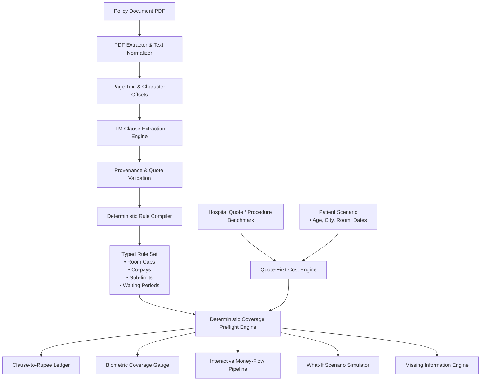

# 🛡️ BimaSetu
### Policy-to-Patient Insurance Coverage & Treatment Cost Intelligence

[-black?style=for-the-badge&logo=next.js)](https://nextjs.org/)
[](https://www.typescriptlang.org/)
[](https://tailwindcss.com/)
[](https://threejs.org/)
[](#core-principle-zero-llm-math)
[-brightgreen?style=for-the-badge)](#-automated-acceptance-tests)

---

## 📌 Executive Summary

Over **70% of health insurance policyholders in India** face surprise out-of-pocket expenses at the hospital billing desk. Complex policy wording, hidden sub-limits, proportionate room rent deductions, waiting period date traps, and age-conditioned co-pays leave patients and families blindsided during critical healthcare events.

**BimaSetu** bridges the gap between insurer contracts and hospital billing. It ingests complex health insurance policy PDFs and hospital estimates, extracts coverage clauses with exact page-level citations, compiles them into strongly-typed executable rules, and performs **pre-admission preflight simulations** with complete **Clause-to-Rupee traceability**.

---

## ⚡ Core Principle: Zero LLM Math

> **"Language models are exceptional at reading comprehension and entity extraction, but catastrophic at financial arithmetic and calendar boundary calculations."**

BimaSetu strictly enforces an architectural boundary:
1. **AI Extraction Layer**: Large Language Models (Google Gemini 2.5 Flash with OpenAI GPT-4o-mini fallback) extract clauses and verbatim textual quotes.
2. **Provenance Verification**: Text citations are cross-checked against exact character spans in the source PDF.
3. **Deterministic Compiler**: Extracts are transformed into typed executable rule sets with conditions, room categories, percentages, and rupee thresholds.
4. **Pure Deterministic Math**: All room rent penalties, co-pays, sub-limits, remaining sum insured deductions, and waiting-period calendar math are computed in pure TypeScript. **An LLM never calculates a rupee value.**

---

## 🌟 Key Features & Visual Architecture

### 1. 🌊 Interactive WebGL Liquid Ether Simulation
- Dynamic Three.js WebGL fluid dynamics canvas running in the background.
- Reacts organically to cursor velocity, hover acceleration, and click physics, providing an ultra-premium glassmorphism feel without sacrificing readability.

### 2. 🎯 Biometric Radial Coverage Gauge (`CoverageGauge.tsx`)
- Bespoke SVG radial progress meter displaying instant percentage of bill covered.
- Dynamic safety tier badges:
  - 🟢 **Insurer Heavy** (>75% covered)
  - 🟡 **Shared Risk** (50% – 75% covered)
  - 🔴 **High Out-of-Pocket** (<50% covered)
- Live tri-color distribution bar comparing Total Hospital Bill vs Insurer Payout vs Patient Out-of-Pocket share.

### 3. 💸 Interactive Money-Flow Pipeline (`ClauseFlowVisualizer.tsx`)
- Animated dash-flow pipeline tracking every stage of hospital cost reduction:
  $$\text{Gross Estimate} \xrightarrow{\text{Room Limit}} \text{Eligible Base} \xrightarrow{\text{Sub-limits}} \text{Capped Base} \xrightarrow{\text{Deductible}} \text{Net Base} \xrightarrow{\text{Co-pay}} \text{Final Insurer Payout}$$
- Click on any pipeline stage to trigger a slide-out audit drawer showing the exact clause, formula, and page evidence.

### 4. 📜 Clause-to-Rupee Traceability Ledger (`CostLedger.tsx`)
- Itemized auditable ledger where every single rupee deducted from the claim is directly connected to:
  - Source policy clause name and section header.
  - Verbatim excerpt from the policy document.
  - Source page number citation.
  - Exact calculation trace (e.g. *"Suite room exceeds Single Private limit of ₹5,000/day. Proportionate deduction applied."*).

### 5. 🔮 "What-If" Scenario Simulator (`WhatIfPanel.tsx`)
- Interactive sandboxing for patients to evaluate alternative admission choices before hospitalization:
  - **Room Upgrade/Downgrade**: Compare *Suite* vs *Single Private* vs *Twin Sharing*.
  - **Senior Citizen Age Shift**: See the impact of the 20% co-pay triggered at age 60+.
  - **Admission Date Shift**: Simulate postponing elective surgery to clear 24-month or 48-month waiting milestones.
- Live side-by-side delta banner displaying immediate savings in rupees.

### 6. ⚠️ Missing Information Engine (`MissingInfoPanel.tsx`)
- Evaluates policy eligibility states (`eligible`, `conditional`, `not_eligible`, `cannot_determine`).
- When critical data is missing (e.g. Policy Inception Date or Pre-Existing Disease history), the engine renders an interrogation prompt with inline interactive controls to resolve ambiguity in real time.

### 7. ⏱️ Waiting Period & Milestone Timeline (`PolicyTimeline.tsx`)
- Calendar-exact date math comparing Policy Inception Date with Scheduled Admission Date:
  - **30-Day Initial Gate**: Immediate accident coverage vs 30-day general illness lockout.
  - **24-Month Specific Illness**: Cataract, hernia, joint replacement, hysterectomy, etc.
  - **36/48-Month Pre-Existing Disease (PED)**: Chronic ailments and pre-declared conditions.

### 8. 🧾 Hospital Quotation Extractor & Line-Item Reconciler (`QuoteReview.tsx`)
- Upload or paste hospital quotation PDFs/text sheets.
- Automatically breaks down costs into:
  - Room & Nursing Charges
  - Surgeon & Operation Theater (OT) Fees
  - Implants & Consumables
  - Diagnostics & Pharmacy
- Editable inline table allowing users to adjust line items, add charges, and test coverage against policy rules.

### 9. 💬 Conversational Policy Assistant (`PolicyQA.tsx`)
- Multi-turn conversational memory with full context retention.
- Powered by dual LLM architecture (Google Gemini 2.5 Flash primary with OpenAI GPT-4o-mini fallback).
- Every answer is paired with page-level citations and verbatim policy excerpts verified against document page text.

### 10. ⚡ 1-Click Instant Demo Presets
- Test the complete intelligence platform instantly without uploading a PDF:
  - **HDFC ERGO Optima Secure** (₹10 Lakh Sum Insured, Single Private Room, 24-month waiting).
  - **Star Health Comprehensive** (₹5 Lakh Sum Insured, Co-pay rules, PED clauses).

---

## 🏗️ System Architecture



---

## 🏥 Indian Surgical Cost Benchmark Matrix

When a hospital quotation is not yet available, BimaSetu utilizes a localized cost matrix calibrated across Tier 1, Tier 2, and Tier 3 Indian cities with hospital category multipliers (Public, Private, Corporate):

| Procedure | Canonical Key | Tier 1 Typical | Tier 2 Typical | Tier 3 Typical | Typical Stay |
| :--- | :--- | :--- | :--- | :--- | :--- |
| **Total Knee Replacement** | `knee_replacement` | ₹2,80,000 | ₹2,20,000 | ₹1,70,000 | 4 days |
| **Cataract Surgery (Phaco)** | `cataract` | ₹45,000 | ₹35,000 | ₹26,000 | 1 day (Daycare) |
| **Coronary Artery Bypass (CABG)** | `cabg` | ₹3,80,000 | ₹2,90,000 | ₹2,20,000 | 7 days |
| **Laparoscopic Appendectomy** | `appendectomy` | ₹95,000 | ₹75,000 | ₹55,000 | 2 days |
| **Coronary Angioplasty (PTCA)** | `angioplasty` | ₹2,20,000 | ₹1,75,000 | ₹1,35,000 | 2 days |
| **Laparoscopic Cholecystectomy** | `cholecystectomy` | ₹1,10,000 | ₹85,000 | ₹65,000 | 2 days |
| **Total Hip Replacement** | `hip_replacement` | ₹3,10,000 | ₹2,40,000 | ₹1,85,000 | 5 days |
| **Hernia Repair (Inguinal/Umbilical)** | `hernia_repair` | ₹85,000 | ₹65,000 | ₹50,000 | 2 days |
| **Hysterectomy (Abdominal/Laparoscopic)** | `hysterectomy` | ₹1,30,000 | ₹1,00,000 | ₹75,000 | 3 days |
| **Kidney Stone Removal (PCNL/URSL)** | `kidney_stone` | ₹90,000 | ₹70,000 | ₹52,000 | 2 days |
| **Tonsillectomy** | `tonsillectomy` | ₹55,000 | ₹42,000 | ₹32,000 | 1 day |
| **Normal Vaginal Delivery** | `maternity_normal` | ₹65,000 | ₹48,000 | ₹35,000 | 2 days |
| **Caesarean Section (C-Section)** | `maternity_csection` | ₹1,15,000 | ₹85,000 | ₹62,000 | 4 days |
| **Tympanoplasty** | `tympanoplasty` | ₹70,000 | ₹55,000 | ₹40,000 | 1 day |
| **Septoplasty** | `septoplasty` | ₹60,000 | ₹48,000 | ₹36,000 | 1 day |
| **Spine Lumbar Discectomy** | `discectomy` | ₹2,40,000 | ₹1,85,000 | ₹1,40,000 | 3 days |

---

## 🧪 Automated Acceptance Tests

BimaSetu includes an automated test suite verifying all core requirements from the BimaSetu Blueprint:

```bash
npm test
```

### Verified Test Cases:
- ✅ **Normalizers & Currency Parsing**: Accurate handling of Indian currency strings (`₹5,00,000`, `2.5 Lakhs`, `Rs 15000`), percentages, and durations.
- ✅ **Procedure Fuzzy Matching**: Natural language mapping (`"knee surgery"` $\rightarrow$ `knee_replacement`).
- ✅ **Missing Information Engine**: Immediate transition to `cannot_determine` with targeted prompts when policy inception date is missing.
- ✅ **Waiting Period Date Boundary Math**: Calendar-exact denial 1 day before the 24-month milestone vs approved eligibility 1 day after.
- ✅ **Age-Conditioned Co-pays**: Strict 20% senior citizen co-pay activation at age 65 while exempting age 55.
- ✅ **Proportionate Room Rent Proration**: Accurate room limit penalties applied when unapproved room tiers (e.g. Deluxe Suite) are selected.
- ✅ **Clause-to-Rupee Traceability**: Direct calculation traces and page citations attached to every single ledger deduction line.

---

## 🚀 Getting Started

### Prerequisites
- **Node.js**: v18.17+ or v20+
- **Package Manager**: `npm`, `pnpm`, or `yarn`

### 1. Clone & Install
```bash
git clone https://github.com/vedant-muglikar/insurance_intelligence.git
cd insurance_intelligence
npm install
```

### 2. Configure Environment Variables
Create a `.env.local` file in the project root:
```env
# Google Gemini API Key (Primary Extractor & Policy Q&A)
GEMINI_API_KEY=your_gemini_api_key_here

# OpenAI API Key (Automatic Fallback Provider)
OPENAI_API_KEY=your_openai_api_key_here
```

Optional: point the app at the ML cost service (defaults shown):
```env
ML_SERVICE_URL=http://127.0.0.1:8000
ML_SERVICE_TIMEOUT_MS=6000
```

### 3. Start the ML Cost Service (recommended)
Treatment costs come from a LightGBM quantile-regression microservice (`ml_service/`). If it is not running, the app falls back to the static benchmark in `lib/estimate/dataset.ts`.
```bash
cd ml_service
pip install -r requirements.txt
python train.py            # tune + train + write models/ and ML_MODEL_EVALUATION.md (skip if models/bundle.pkl exists)
python -m uvicorn main:app --port 8000
```
Model quality and methodology: [`ml_service/ML_MODEL_EVALUATION.md`](ml_service/ML_MODEL_EVALUATION.md).

### 4. Run Development Server
```bash
npm run dev
```
Open [http://localhost:3000](http://localhost:3000) in your browser.

### 5. Build for Production
```bash
npm run build
npm start
```

---

## 📁 Repository Structure

```
insurance_intelligence/
├── app/
│   ├── api/
│   │   ├── policy/analyze/      # Policy PDF ingestion & rule compilation
│   │   ├── policy/ask/          # Multi-turn Q&A with dual LLM fallback
│   │   ├── quote/analyze/       # Hospital estimate OCR & line-item parser
│   │   └── estimate/cost/       # Proxy to the ML cost microservice (P10/P50/P90 + line items)
│   ├── globals.css              # Custom keyframe animations, glassmorphism, HUD styles
│   ├── layout.tsx               # Root layout & font definitions
│   └── page.tsx                 # Main application with LiquidEther WebGL canvas
├── components/
│   ├── policy/
│   │   ├── ClaimReadiness.tsx   # Pre-authorization hospital readiness checklist
│   │   ├── ClauseFlowVisualizer.tsx # Interactive animated money-flow pipeline
│   │   ├── CostLedger.tsx       # Clause-to-Rupee traceability ledger
│   │   ├── CoverageGauge.tsx    # Biometric SVG radial coverage meter
│   │   ├── EstimateForm.tsx     # Preflight calculation engine & workspace
│   │   ├── ExportSummary.tsx    # Printable summary report & JSON export
│   │   ├── MissingInfoPanel.tsx # Interactive interrogation engine for missing facts
│   │   ├── PolicyQA.tsx         # Conversational policy assistant
│   │   ├── PolicyResults.tsx    # Main results container with GooeyNav tabs
│   │   ├── PolicyTimeline.tsx   # Waiting-period milestone track
│   │   ├── ProcessingTimeline.tsx # Cybernetic scanner HUD with laser sweep
│   │   ├── QuoteReview.tsx      # Hospital quote line-item reconciler
│   │   ├── UploadScreen.tsx     # Drag-and-drop dropzone with 1-click sample presets
│   │   └── WhatIfPanel.tsx      # Interactive what-if scenario sandboxing
│   ├── ui/
│   │   ├── GooeyNav.tsx         # Fluid gooey navigation tab switcher
│   │   ├── LiquidEther.tsx      # Three.js WebGL fluid dynamics canvas
│   │   ├── loader-4.tsx         # Multi-ring cybernetic spinner
│   │   └── onboard-card.tsx     # Animated multi-stage step indicator
│   ├── landing-page.tsx         # BimaSetu product landing page
│   └── policy-lens.tsx          # Main state machine (upload -> processing -> results)
├── lib/
│   ├── ai/
│   │   ├── ask.ts               # Multi-turn LLM reasoning & quote verification
│   │   └── extractor.ts         # Policy clause extraction schemas
│   ├── estimate/
│   │   ├── cost.ts              # Quote-first cost calculation & room scaling
│   │   ├── coverage.ts          # Deterministic preflight arithmetic
│   │   ├── dataset.ts           # 16-procedure Indian surgical cost database
│   │   ├── matching.ts          # Fuzzy procedure matching & synonyms
│   │   └── policy.ts            # Waiting-period date math & rule evaluation
│   ├── pdf/
│   │   ├── extractor.ts         # Server-side PDF page extraction
│   │   └── validation.ts        # Client-safe verbatim text verification
│   ├── policy/
│   │   ├── compiler.ts          # Deterministic Policy Rule Compiler
│   │   ├── normalizers.ts       # Indian currency, room, and duration parsers
│   │   └── samplePolicies.ts    # Pre-compiled HDFC ERGO & Star Health policies
│   └── types/
│       ├── estimate.ts          # Preflight, ledger, and scenario type definitions
│       └── policy.ts            # Compiled rules, categories, and evidence types
└── tests/
    └── acceptance_tests.ts      # 7 core acceptance tests from Blueprint Section 15
```

---

## 🔒 Security & Privacy

- **Client Privacy First**: Policy PDFs and hospital quotations are parsed strictly in temporary server memory. Documents are **never written to persistent disk or cloud storage**, nor are they retained or shared with third parties.
- **Auditable Integrity**: Every financial figure presented to the patient is reproducible and backed by a deterministic calculation trace linking directly to the insurer's policy wording.

---

## 📄 License
This project is licensed under the [MIT License](LICENSE).
## Saved policy analyses (Supabase)

Uploads are identified by the policy's IRDAI **UIN** (which includes the product version) and a hash of the text.
If the same wording was analysed before, its rules are loaded from `plan_templates`, `compiled_rules` and
`extracted_pages` instead of calling the LLM, and the chatbot reads its context from those pages.

1. Run `supabase/migrations/20261010000000_policy_cache.sql` once in the Supabase SQL editor.
2. Set `SUPABASE_SERVICE_ROLE_KEY` (server only) in `.env.local`.

Matching never uses the policy name. A saved analysis is reused only on an exact document-hash match, or an exact UIN
match plus at least 80% text similarity. Without the key the app works as before and runs the LLM on every upload.
